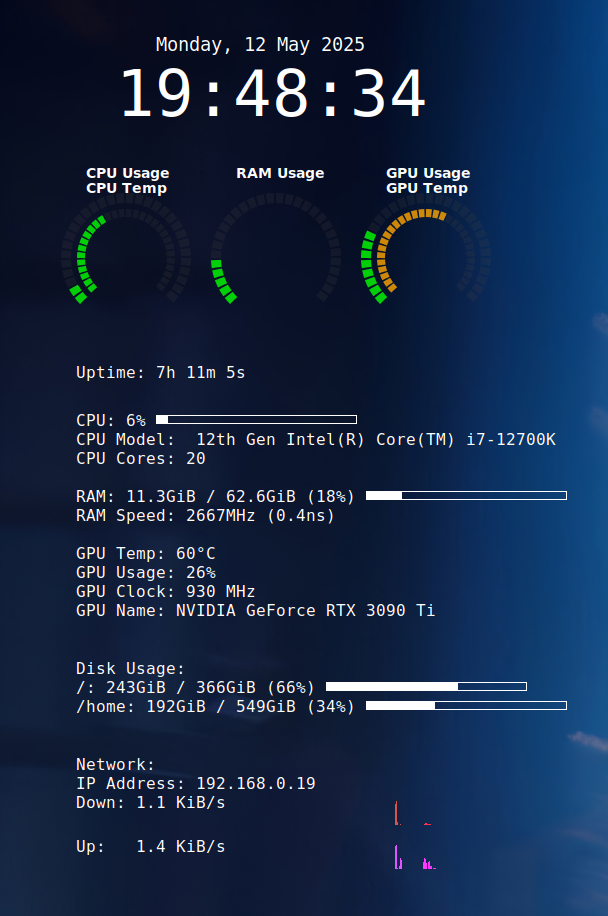

# 🖥️ Linux Stats Display

> 📐 Optimized for 1280×800 displays (e.g., small dedicated monitors). You can edit `stats.conf` and `rings.lua` to adapt to other resolutions. For a rotated layout, see the `landscape` branch.

A full-screen Conky dashboard to monitor CPU, GPU, RAM, network, and disk stats on a dedicated display (e.g., a third monitor). Features include graphical segmented rings, real-time graphs, temperature-based color coding, and system info.

---

## 📦 Pre-requisites

Install the following packages:

```bash
sudo apt update
sudo apt install conky-all lm-sensors lshw
```

> 💡 Tip: You may also need to run `sensors-detect` once:

```bash
sudo sensors-detect
```

For full RAM info access without prompt:

```bash
sudo visudo
# Add this line, replacing "yourusername" with your actual user:
yourusername ALL=(ALL) NOPASSWD: /usr/bin/lshw
```

---

## 🚀 Usage

If you're using multiple monitors, you may need to adjust the display position. For example, if your third monitor is positioned to the right, set `gap_x` in `stats.conf` to match the screen offset (e.g., 2560+ for a 1440p monitor). Use `xrandr` to determine screen layout:

```bash
xrandr | grep " connected"
```

### Option 1: Run as systemd service (recommended)

For automatic startup on boot and auto-restart on failure:

```bash
cd ~/workspaces/zozo_ws/linux-stats-display
./install_service.sh
```

This will:
- Install a user-level systemd service
- Enable auto-start on login/reboot
- Auto-restart if conky crashes
- Enable user lingering for boot-time startup

Useful service commands:

```bash
systemctl --user status stats-display.service      # Check status
systemctl --user stop stats-display.service        # Stop
systemctl --user start stats-display.service       # Start
systemctl --user restart stats-display.service     # Restart
journalctl --user -u stats-display.service -f      # View logs
```

### Option 2: Run manually

Kill any running Conky instances first:

```bash
pkill conky
```

Then launch the dashboard:

```bash
conky -c ~/.config/conky/stats.conf
```

Make sure your config and ring scripts are in place:

```
~/.config/conky/stats.conf      # Main Conky config file
~/.config/conky/rings.lua       # Custom Lua drawing script
```

---

## 🧩 Features

- 📐 Default resolution: **1280×800**
- 🔄 Optional landscape layout available in the [`landscape` branch](https://github.com/yourrepo/linux-stats-display/tree/landscape)

- ✅ Segmented **ring graphs** for CPU, RAM, GPU usage and temperature
- ✅ **Dynamic color coding** (green → orange → red) based on usage
- ✅ System stats: uptime, time/date, CPU model, core count
- ✅ GPU info (clock, name, temp) via `nvidia-smi`
- ✅ RAM info (speed and vendor) via `lshw`
- ✅ Disk usage bars
- ✅ Real-time **network usage graphs** with dynamic color bars
- ✅ Custom layout optimized for 1200×800 display (perfect for third monitor dashboards)

---

## 🖼️ Example Display



---

## 🛠️ Customization

You can customize:

- Ring positions (`rings.lua`)
- Fonts and colors (`stats.conf`)
- Display interfaces (e.g., replace `wlp5s0` with your actual network adapter)
- RAM/CPU/GPU display intervals
